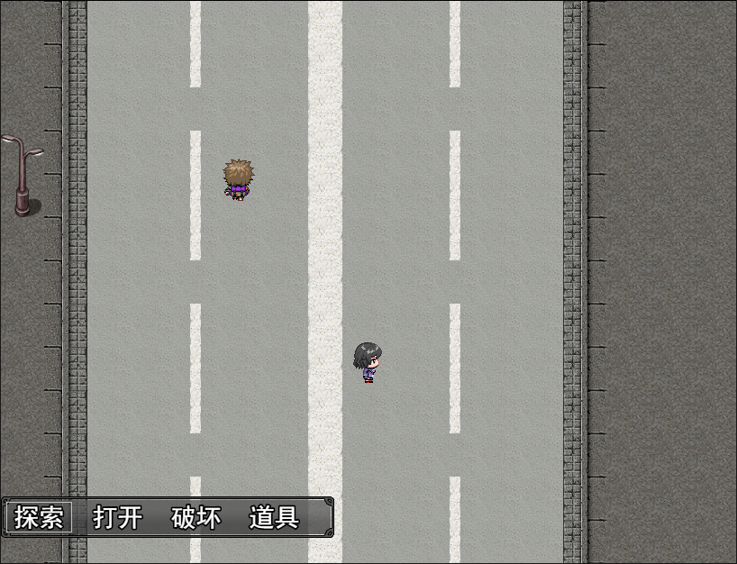

瞎糊了一个，事件交互其实还是有点用处的。
<!--more-->
随手录了个gif。。(文件较大流量注意)
***
新增了窗口滑动，写到window_base里了。。做个基础模块吧。。还有加了触控支持。。效果不是那么好

小改了下窗口皮肤，让选项看起来比较舒服，之前那个有点魔幻风，现在的比较现代了

***

窗口皮肤不是那么适配的感觉。可能还需要加工下吧\_(:з」∠)_

妈个鸡，md用起颜文字还有点难受的。。

