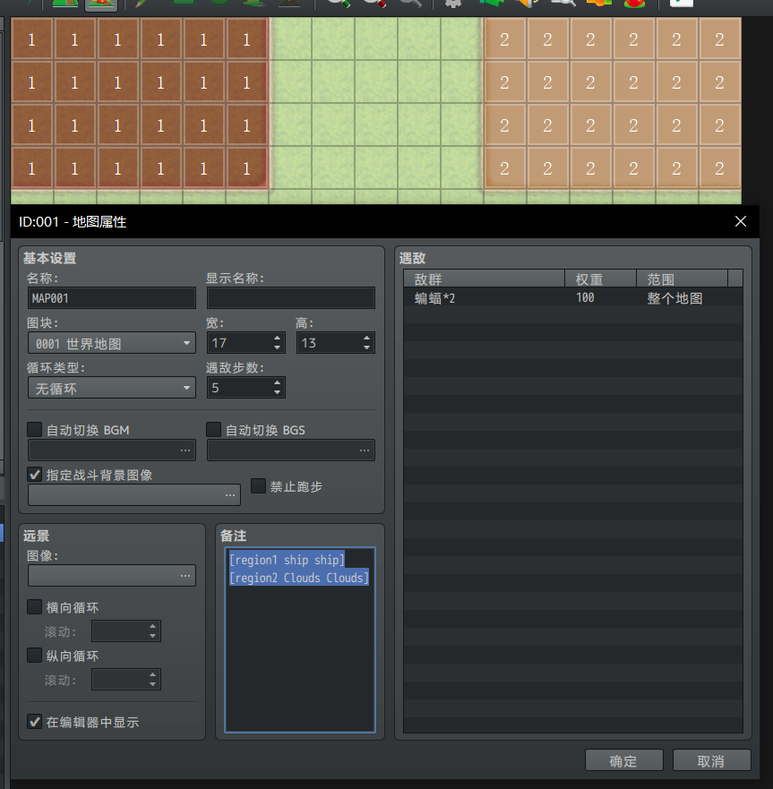
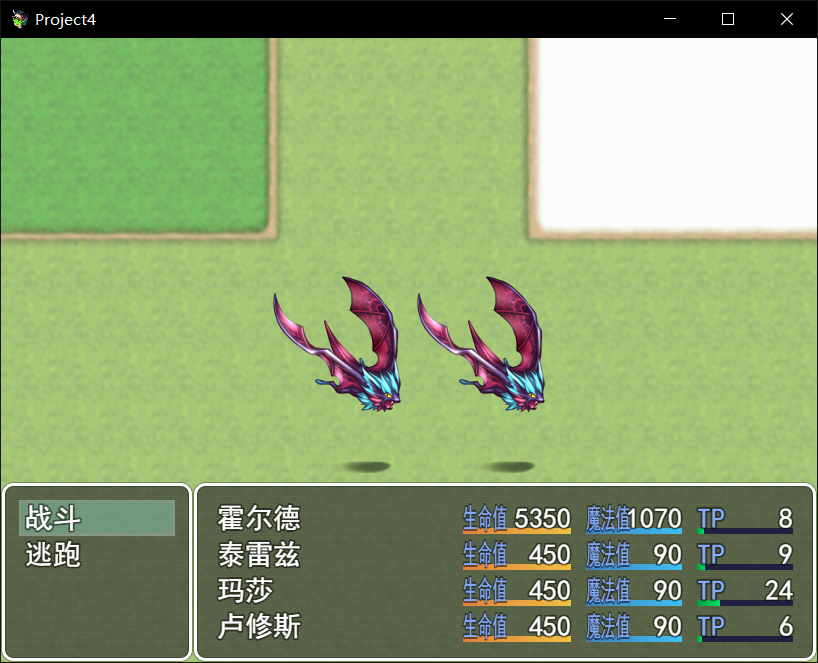

### 区域更改战斗背景图

想下图一样在地图备注加上[regionX filename1 filename2]这样子的备注

然后在游戏里就是下面的效果 被标记1的区域

被标记2的区域

如果是默认 那会调用地图的战斗背景设置 下图是没设置地图的默认情况会把地图截图来当背景


下面是插件脚本  


```javascript
//=============================================================================
// RegionBattleBackGround.js
//=============================================================================
/*:
 * @plugindesc use map note control battle background  image
 * @author EnpisuLin
 *
 * @help
 * ============================================================================
 * Notetags Instructions
 * ============================================================================
 * Note: Input your notetags inside the map properties like following.
 *       [region1 Ship Ship]
 *       use battlebackground1 file named "Ship" and battlebackground2 file
 *       named "Ship" when battle start in region 1
 *
 */
(function() {
    Game_Map.prototype.regionBattleBack = function(regionId) {
        var battleback1name = this.battleback1Name();
        var battleback2name = this.battleback2Name();
        $dataMap.note.split('\n').forEach(function(i){
            var data = i.split(/\[region| |\]/);
            var id = data[1];
            if(id == regionId){
                battleback1name = data[2];
                battleback2name = data[3];
            };
        });
        return [battleback1name,battleback2name];
    };
    Spriteset_Battle.prototype.battleback1Name = function() {
        if (BattleManager.isBattleTest()) {
            return $dataSystem.battleback1Name;
        }else if($gameMap.regionBattleBack($gamePlayer.regionId())){
            return $gameMap.regionBattleBack($gamePlayer.regionId())[0];
        } else if ($gameMap.battleback1Name()) {
            return $gameMap.battleback1Name();
        } else if ($gameMap.isOverworld()) {
            return this.overworldBattleback1Name();
        } else {
            return '';
        }
    };

    Spriteset_Battle.prototype.battleback2Name = function() {
        if (BattleManager.isBattleTest()) {
            return $dataSystem.battleback2Name;
        }else if($gameMap.regionBattleBack($gamePlayer.regionId())){
            return $gameMap.regionBattleBack($gamePlayer.regionId())[1];
        } else if ($gameMap.battleback2Name()) {
            return $gameMap.battleback2Name();
        } else if ($gameMap.isOverworld()) {
            return this.overworldBattleback2Name();
        } else {
            return '';
        }
    };

})()
```