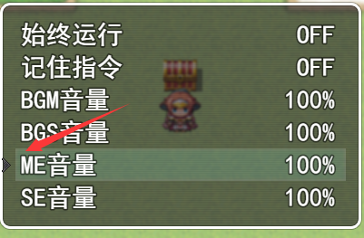

其实外站有很多这样的插件~~所以不要用这个233~~

其实就是自己糊好了整合放在自己游戏的插件里面了但想想还是扒出来一份方便大家~~就算没人用~~

然后之后的插件一般会有个人的变量声明而不是随随便便声明一个变量了

也研究下1.5版本的插件管理器的新参数设置吧=w=



放一份本体 然后文章末尾有js文件的下载 使用复制的话请新建Enpitsu_Sprite_WindowCursor.js再粘贴进去
```javascript
//=============================================================================
// Enpitsu_Sprite_WindowCursor.js
//=============================================================================
/*:
 * @plugindesc add a cursor animation on selectable window
 * @author EnpitsuLin
 *
 * @param Filename
 * @desc Filename of animation file (in img/system)
 * @default WindowCursor
 *
 * @param FrameCount
 * @desc frame count of animation
 * @default 8
 *
 * @param Speed
 * @desc animation play speed
 * @default 6
 */
/*:zh
 * @plugindesc 在选项窗口中增加了一个动态光标
 * @author EnpitsuLin
 *
 * @param Filename
 * @desc 动画文件的文件名(在img/system文件夹下)
 * @default WindowCursor
 *
 * @param FrameCount
 * @desc 动画文件的帧数
 * @default 8
 *
 * @param Speed
 * @desc 动画播放速度
 * @default 6
 *
 */
(function(){
    var Enpitsu = Enpitsu || {};
    Enpitsu.windowCursor = {};
    Enpitsu.windowCursor.Parameters = PluginManager.parameters('Enpitsu_Sprite_WindowCursor');
    //==================================================================================================================
    Enpitsu.windowCursor.filename = Enpitsu.windowCursor.Parameters['Filename'] || "Window_Cursor";
    Enpitsu.windowCursor.frameCount = Number(Enpitsu.windowCursor.Parameters['FrameCount']) || 8;
    Enpitsu.windowCursor.speed = Number(Enpitsu.windowCursor.Parameters['Speed']) || 8;

    //------------------------------------------------------------------------------------------------------------------
    //==================================================================================================================
    function Sprite_WindowCursor() {
        this.initialize.apply(this, arguments);
    }

    Sprite_WindowCursor.prototype = Object.create(Sprite_Base.prototype);
    Sprite_WindowCursor.prototype.constructor = Sprite_WindowCursor;

    Sprite_WindowCursor.prototype.initialize = function(window) {
        Sprite_Base.prototype.initialize.call(this);
        this._window = window;
        this.createImage();
        this._ticker = 0;
        this._pattern = 0;
        this.updateFrame();
    };

    Sprite_WindowCursor.prototype.createImage = function() {
        this.bitmap = ImageManager.loadSystem(Enpitsu.windowCursor.filename);
        this._frameWidth = this.bitmap.width / Enpitsu.windowCursor.frameCount;
        this._frameHeight = this.bitmap.height;
        this._maxPattern = Enpitsu.windowCursor.frameCount - 1;
        this._tickSpeed = Enpitsu.windowCursor.speed;
        this.anchor.y = 0.5;
        this.opacity = 0;
    };

    Sprite_WindowCursor.prototype.update = function() {
        Sprite_Base.prototype.update.call(this);
        if (this._window.isCursorVisible()) {
            this.opacity = this._window.openness >= 255 ? 255 : 0;
            if (this._window.active) this.updateFrame();
            this.updatePosition();
        } else {
            this.opacity = 0;
        };
    };

    Sprite_WindowCursor.prototype.updateFrame = function() {
        var pw = this._frameWidth;
        var ph = this._frameHeight;
        var sx = this._pattern * pw;
        this.setFrame(sx, 0, pw, ph);

        this._ticker += 1;
        if (this._ticker >= this._tickSpeed) {
            this._pattern = (this._pattern == this._maxPattern) ? 0 : this._pattern + 1;
            this._ticker = 0;
        };
    };

    Sprite_WindowCursor.prototype.updatePosition = function() {
        var rect = this._window._cursorRect;
        this.y = rect.y + this._window.standardPadding() + this.yPos(rect.height);
        this.x = rect.x - 10;
    };

    Sprite_WindowCursor.prototype.yPos = function(height) {
        return height / 2;
    };

    var _cursorWindow_Selectable_initialize = Window_Selectable.prototype.initialize;
    Window_Selectable.prototype.initialize = function(x, y, width, height) {
        _cursorWindow_Selectable_initialize.call(this,x,y,width,height);
        this.createWindowCursor();
    };
    Window_Selectable.prototype.createWindowCursor = function() {
        this._windowCursor = new Sprite_WindowCursor(this);
        this.addChild(this._windowCursor);
    };

    Window_NumberInput.prototype.createWindowCursor = function() {
    };

    Window_ShopNumber.prototype.createWindowCursor = function() {
    };

    Window_BattleStatus.prototype.createWindowCursor = function() {
    };
})();
```
[右键另存为](https://raw.githubusercontent.com/enpitsuLin/MV-plugin/master/%E7%AA%97%E5%8F%A3%E5%92%8C%E5%9C%BA%E6%99%AF/Enpitsu_Sprite_WindowCursor.js)